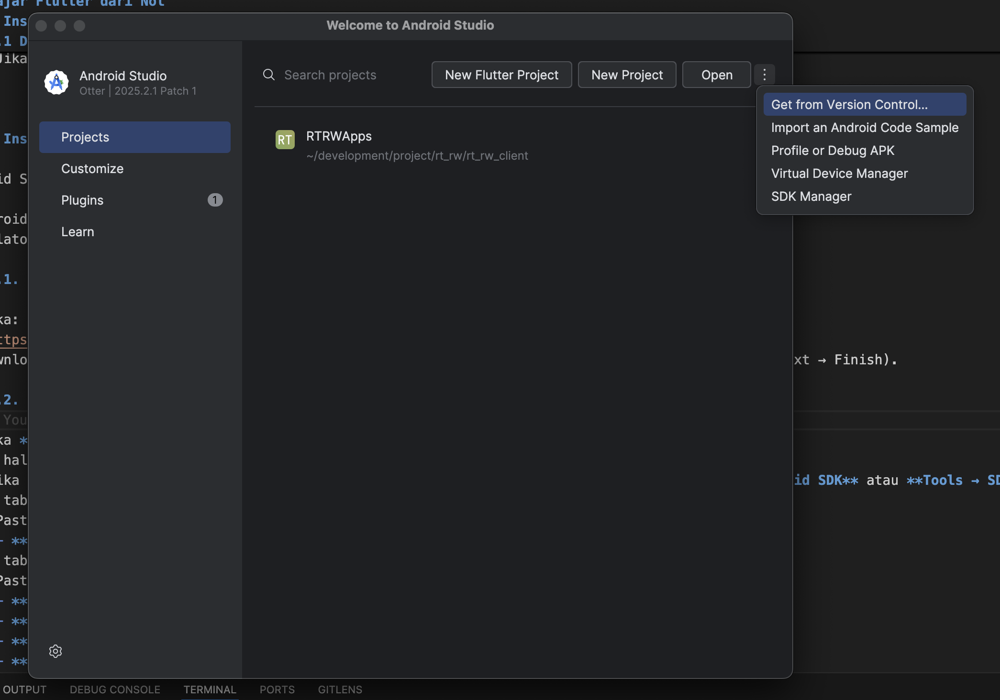
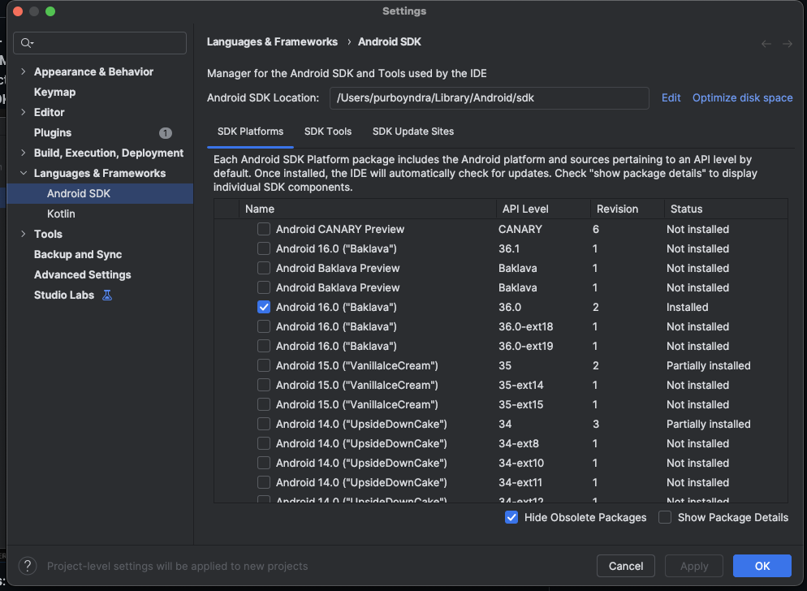
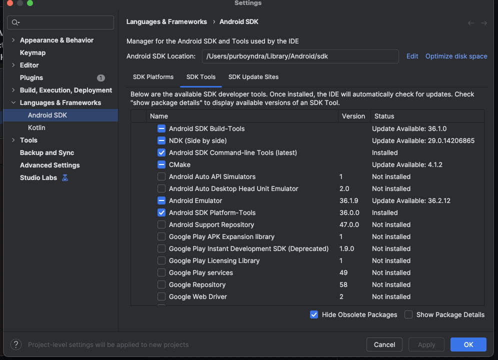
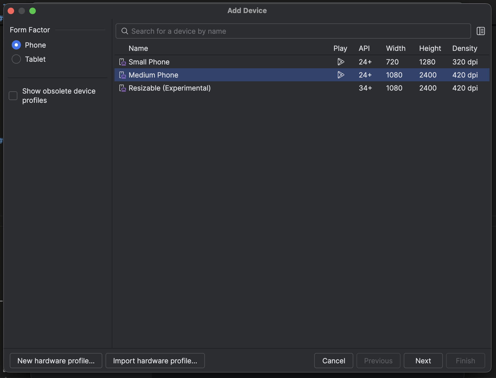
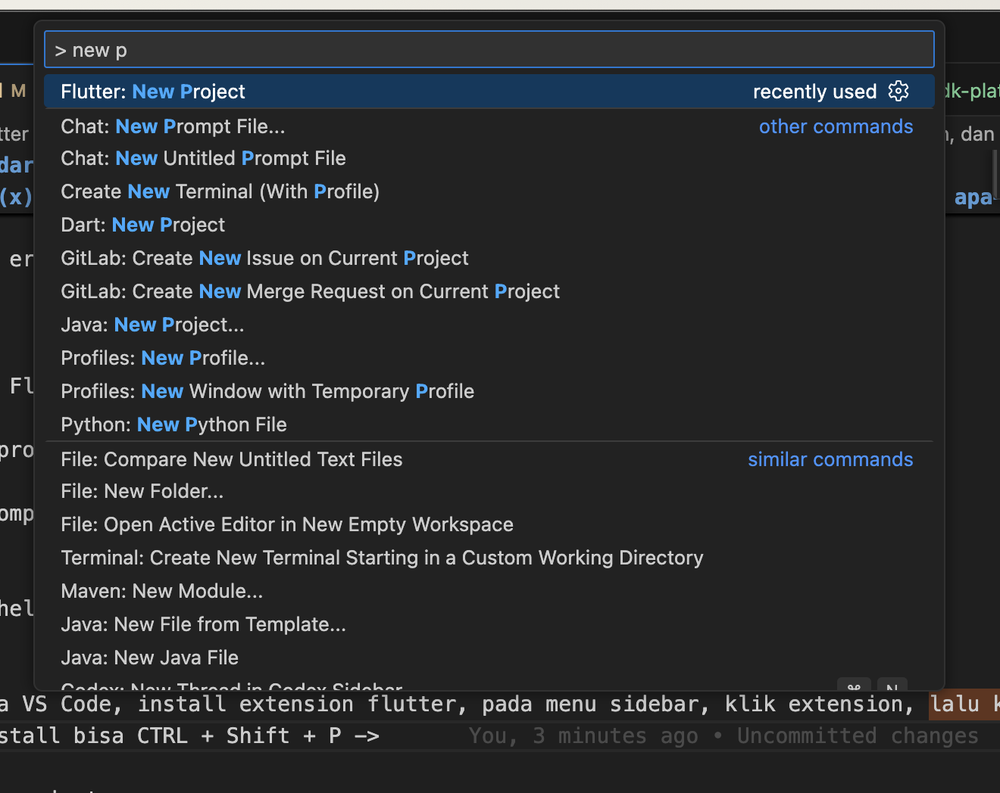
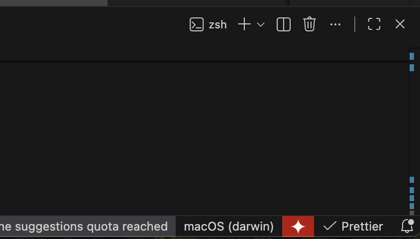

# Belajar Flutter dari Nol

**Install Flutter + Emulator sampai Hello World**

Dokumen ini menjelaskan langkah demi langkah untuk meng-install Flutter di Windows dan menjalankan aplikasi **Hello World** pertama kamu di emulator Android.

> Target: setelah mengikuti semua langkah, kamu bisa melihat teks **“Hello World!”** di emulator Android.

---

## Daftar Isi

- [1. Prasyarat](#1-prasyarat)
- [2. Install Flutter SDK](#2-install-flutter-sdk)
- [3. Install Android Studio + Android SDK + Emulator](#3-install-android-studio--android-sdk--emulator)
  - [3.1. Install Android Studio](#31-install-android-studio)
  - [3.2. Pastikan Android SDK & Tools terpasang](#32-pastikan-android-sdk--tools-terpasang)
  - [3.3. Buat emulator (Android Virtual Device / AVD)](#33-buat-emulator-android-virtual-device--avd)
- [4. Install VS Code + Extension Flutter](#4-install-vs-code--extension-flutter)
- [5. Cek lingkungan dengan flutter doctor](#5-cek-lingkungan-dengan-flutter-doctor)
- [6. Buat project Flutter pertama](#6-buat-project-flutter-pertama)
- [7. Jalankan aplikasi di emulator](#7-jalankan-aplikasi-di-emulator)
  - [7.1. Pastikan emulator menyala](#71-pastikan-emulator-menyala)
  - [7.2. Jalankan dari VS Code](#72-jalankan-dari-vs-code)
- [8. Ubah UI jadi “Hello World”](#8-ubah-ui-jadi-hello-world)
- [9. Troubleshooting (masalah umum)](#9-troubleshooting-masalah-umum)
- [10. Langkah selanjutnya](#10-langkah-selanjutnya)

---

## 1. Prasyarat

Sebelum mulai, siapkan dulu:

- **Sistem operasi**: Windows 10 / 11 (64-bit)
- **Koneksi internet**
- **Ruang kosong**: minimal 10–15 GB (untuk Android Studio, SDK, emulator)

---

## 2. Install Flutter SDK

1. Buka situs resmi Flutter:  
   [https://flutter.dev](https://flutter.dev) → klik **Docs** (di pojok kanan atas) → **Get started** → pilih **Windows**.

2. Klik/tap **Custom setup**
   - Klik **Install Manually**. Sebelum itu, make sure kita sudah set up IDEnya, di sini saya menggunakan VS Code, jadi teman-teman bisa klik VS Code pada section **Set up an IDE or editor**, lalu ikuti step by stepnya.
   - Jika sudah setup/download IDE, kembalu ke [https://docs.flutter.dev/get-started/custom], pilih **Install manually**.
   - Pada **Choose your development platform**, sesuaikan dengan OS teman-teman, let's say menggunakan Windows, maka pilih Windows.
   - Jangan lupa untuk install/setup GIT, dengan mengklik **Git for windows**. Jika kita mau push/pull codingan ke Github/Gitlab, maka GIT wajib, jika tidak perlu, bisa diskip.

### 2.1 Download Flutter **SDK (stable)** untuk Windows (file `.zip`).

3. Setelah selesai download:
   - Klik kanan file `.zip` → **Extract All**.
   - Pindahkan folder hasil extract ke lokasi yang mudah diingat, misalnya:
     - `C:\src\flutter`  
       atau
     - `C:\development\flutter`
   - Hindari folder yang butuh izin admin atau administrator ya, seperti `C:\Program Files`.

4. Tambahkan Flutter ke **PATH**:
   - Klik tombol **Start** → ketik **Environment Variables** → pilih  
     **“Edit the system environment variables”**.
   - Klik tombol **Environment Variables…**.
   - Di bagian **User variables**, pilih `Path` → klik **Edit**.
   - Klik **New** → isi dengan path ke folder `bin` Flutter, misalnya:
     - `C:\src\flutter\bin`
   - Klik **OK** sampai semua jendela tertutup.
   - Jika belum berhasil, dapat coba mengikuti step by step ini ['https://docs.flutter.dev/install/manual#add-to-path]

5. Cek apakah Flutter sudah terpasang:
   - Buka **Command Prompt** (CMD) atau **PowerShell**.
   - Ketik:

     ```bash
     flutter --version
     ```

   - Jika muncul versi Flutter (bukan error), berarti instalasi Flutter berhasil.

   - Jika tidak muncul, troubleshoot kita bahas di bawah ya...

---

## 3. Install Android Studio + Android SDK + Emulator

['https://docs.flutter.dev/platform-integration/android/setup']

Android Studio dibutuhkan untuk:

- Android SDK (alat build untuk Android)
- Emulator (HP Android virtual)

### 3.1. Install Android Studio

1. Buka:  
   [https://developer.android.com/studio](https://developer.android.com/studio)
2. Download **Android Studio** (Versi sekarang Otter) untuk Windows dan install seperti biasa (Next → Next → Finish).

### 3.2. Pastikan Android SDK & Tools terpasang

1. Buka **Android Studio**.
2. Di halaman awal, klik **More Actions → SDK Manager**  
    (jika sudah ada project, lewat menu **File/Settings → Appearance & Behavior → System Settings → Android SDK** atau **Tools → SDK Manager**). SDK Manager dapat di lihat pada bagian paling bawah dari pop three dots icon.
   
3. Di tab **SDK Platforms**:
   - Pastikan ada minimal satu versi Android yang tercentang, misalnya: - **Android 14 (API 34)** atau yang terbaru. Saya hanya menginstall latest SDK (Android 16)
     
4. Di tab **SDK Tools**:
   - Pastikan opsi ini tercentang:
     - **Android SDK Build-Tools**
     - **Android SDK Platform-Tools**
     - **Android SDK Command-line Tools**
     - **Android Emulator**
   - Klik **Apply** / **OK** → tunggu proses download selesai.
     

### 3.3. Buat emulator (Android Virtual Device / AVD)

1. Di Android Studio:
   - Dari halaman awal: **More Actions → Virtual Device Manager**,  
     atau
   - Jika ada project: menu **Tools → Device Manager**.
2. Klik tombol **Create Device** (`+`) <- Klik icon plus pada bagian atas (Deretan icon Firebase (Api))
3. Pilih tipe device, lalu klik Next pada bagian bawah kanan
   
4. Pilih versi Android (system image), misalnya Android 16 (latest) API 36:
   - Kalau belum ada, klik **Download** lalu tunggu sampai selesai.
5. Klik **Next → Finish**.
6. Di daftar device, klik tombol **Play ▶** untuk menyalakan emulator.
   - Tunggu sampai emulator menyala dan tampilan Android muncul.

---

## 4. Install VS Code + Extension Flutter

VS Code adalah editor kode yang ringan dan nyaman untuk Flutter.

1. Download VS Code di:  
   [https://code.visualstudio.com](https://code.visualstudio.com)
2. Install seperti biasa.
3. Buka **VS Code**.
4. Buka tab **Extensions** (ikon kotak di sidebar kiri).
5. Cari dan install:
   - **Flutter**
   - **Dart** (biasanya otomatis terpasang saat install Flutter extension)

---

## 5. Cek lingkungan dengan flutter doctor

Perintah ini akan mengecek apakah semua kebutuhan Flutter sudah siap.

1. Buka **Command Prompt** / **PowerShell**.
2. Jalankan:

   ```bash
   flutter doctor
   ```


## Terdapat tanda (x) pada Google Chrome, karena di device saya tidak menggunakan, dan tidak apa-apa (Jika tidak ingin develop web app)




## Note: Reference 7.2. Klik Select Device, atau jika mengikuti screenshot, klik macOS (darwin), jika emulator sudah terinstall, akan muncul pilihannya. Bisa langsung klik emulator yang telah diinstal sebelumnya.

````

3. Tunggu sampai proses selesai.

- Kalau banyak tanda **[✓]**, berarti sudah oke.
- Kalau ada peringatan soal **Android licenses**, jalankan:

  ```bash
  flutter doctor --android-licenses
  ```

  Lalu tekan `y` / `yes` untuk semua lisensi.

4. Jalankan lagi:

   ```bash
   flutter doctor
   ```

Pastikan tidak ada error besar

---

## 6. Buat project Flutter pertama

Kita akan membuat project bernama `hello_world`.

1. Di **Command Prompt** / **PowerShell**, jalankan:

   ```bash
   flutter create hello_world
   ```

   - Atau bisa buka VS Code, install extension flutter, pada menu sidebar, klik extension, lalu ketikkan `flutter`, install
   - Setelah terinstall bisa CTRL + Shift + P -> ketikkan `new project` -> Pilih Flutter: New Project (Lihat Gambar di atas) -> Pilih Application -> Pilih directory mau simpan project dimana -> ketikkan nama, misal `hello_world`

2. Masuk ke folder project:

   ```bash
   cd hello_world
   ```

3. Buka project di VS Code:
   - Jika VS Code sudah ditambahkan ke PATH, bisa langsung:

     ```bash
     code .
     ```

   - Atau buka VS Code → **File → Open Folder…** → pilih folder `hello_world`.

---

## 7. Jalankan aplikasi di emulator

### 7.1. Pastikan emulator menyala

1. Buka **Android Studio → Device Manager / Virtual Device Manager**.
2. Klik **Play ▶** di emulator yang sudah kamu buat.
3. Tunggu sampai Android muncul sepenuhnya (home screen).

### 7.2. Jalankan dari VS Code

1. Di VS Code, lihat bagian kanan bawah (Liaht Gambar di atas):
   - Seharusnya muncul nama device/emulator (misalnya `Pixel_4_API_34`).
   - Kalau belum muncul, klik bagian tersebut dan pilih emulator yang tersedia.

2. Jalankan aplikasi:
   - Menu **Run → Start Debugging**, atau
   - Tekan **F5**, atau
   - Buka terminal di project dan jalankan:

     ```bash
     flutter run
     ```

3. Build pertama biasanya agak lama. Setelah selesai, layar emulator akan menampilkan aplikasi Flutter default (tulisan "You have pushed the button this many times" dan tombol `+`).

---

## 8. Ubah UI jadi “Hello World”

Sekarang kita sederhanakan tampilan agar hanya muncul teks **Hello World!**.

1. Di VS Code, buka file:

   ```text
   lib/main.dart
   ```

2. Hapus isi file tersebut dan copy paste dengan kode berikut:

   ```dart
   import 'package:flutter/material.dart';

   void main() {
     runApp(const MyApp());
   }

   class MyApp extends StatelessWidget {
     const MyApp({super.key});

     @override
     Widget build(BuildContext context) {
       return MaterialApp(
         debugShowCheckedModeBanner: false,
         title: 'Hello World App',
         home: Scaffold(
           appBar: AppBar(
             title: const Text('Flutter Pertamaku'),
           ),
           body: const Center(
             child: Text(
               'Hello World!',
               style: TextStyle(
                 fontSize: 24,
               ),
             ),
           ),
         ),
       );
     }
   }
   ```

3. Simpan file (`Ctrl + S`).

4. Kalau aplikasi masih berjalan:
   - Gunakan fitur **hot reload** (ikon petir / tombol 🔁 di VS Code),
   - atau di terminal `flutter run`, tekan `r`.
   - Kalau bingung, stop dulu prosesnya lalu jalankan lagi:

     ```bash
     flutter run
     ```

5. Di emulator sekarang harusnya tampil:
   - App bar dengan judul **“Flutter Pertamaku”**
   - Teks di tengah: **“Hello World!”**

---

## 9. Troubleshooting (masalah umum)

**1. `flutter` tidak dikenali di CMD / PowerShell**

- Pastikan path `C:\src\flutter\bin` (atau lokasi Flutter kamu) sudah ditambahkan ke **Environment Variables → User variables → Path**.
- Setelah mengubah PATH, tutup dan buka lagi CMD/PowerShell.

---

**2. `flutter doctor` bilang “Android toolchain not configured” atau “Android SDK not found”**

- Pastikan Android Studio sudah terinstall.
- Buka **SDK Manager** dan pastikan:
  - Minimal satu **SDK Platform** tercentang.
  - **Android SDK Platform-Tools**, **Build-Tools**, **Command-line Tools**, dan **Android Emulator** terinstall.

---

**3. `No devices available` saat `flutter devices` atau di VS Code**

- Pastikan emulator di Android Studio sudah dijalankan (klik **Play ▶**).
- Coba jalankan:

  ```bash
  flutter devices
  ```

  untuk cek apakah emulator terdeteksi.

---

**4. Emulator lemot / nggak kuat**

- Kalau komputer terasa berat:
  - Tutup aplikasi lain yang tidak perlu.
  - Atau pakai **HP Android asli**:
    - Aktifkan **Developer Options** dan **USB debugging** di HP.
    - Hubungkan ke PC dengan kabel USB.
    - Jalankan:

      ```bash
      flutter devices
      ```

---

## 10. Langkah selanjutnya

Setelah berhasil menampilkan “Hello World!”, kamu bisa lanjut belajar:

- Widget dasar: `Text`, `Row`, `Column`, `Container`, `Image`, `ListView`.
- Cara mengatur warna, margin, padding, dan layout.
- Cara menambahkan halaman baru (navigation / routes).

```
````
